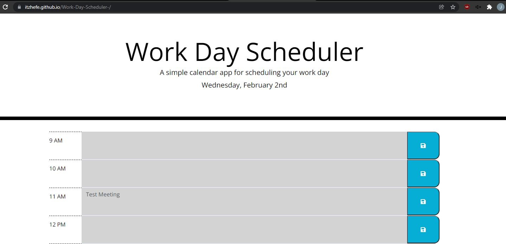
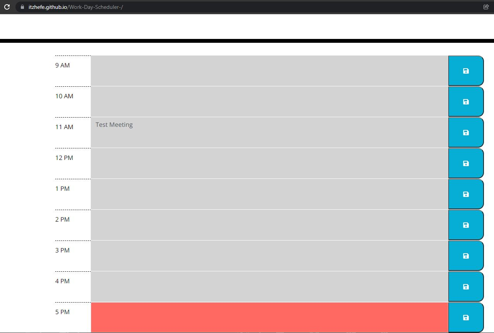

# Work-Day-Scheduler:

* The application is built to help breakdown different events during the working day by saving the event in local storage
* In addition, color code the time slots to help the user know what time it is and what time blocks they have left in the current day

## Acceptance Criteria:

```md
GIVEN I am using a daily planner to create a schedule
WHEN I open the planner
THEN the current day is displayed at the top of the calendar
WHEN I scroll down
THEN I am presented with timeblocks for standard business hours
WHEN I view the timeblocks for that day
THEN each timeblock is color coded to indicate whether it is in the past, present, or future
WHEN I click into a timeblock
THEN I can enter an event
WHEN I click the save button for that timeblock
THEN the text for that event is saved in local storage
WHEN I refresh the page
THEN the saved events persist
```

## Links to deployed application:

[Day Scheduler Live Page](https://itzhefe.github.io/Work-Day-Scheduler-/)

[GitHub Page](https://github.com/ItzHefe/Work-Day-Scheduler-)

## Screenshot of working functionality:

Working Current Day:


Working Color Coding:
